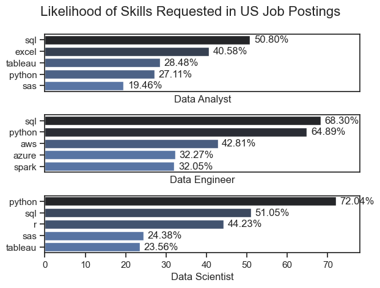
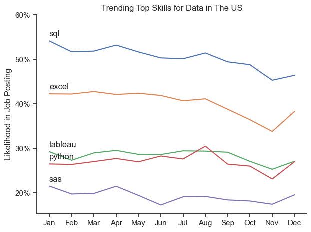
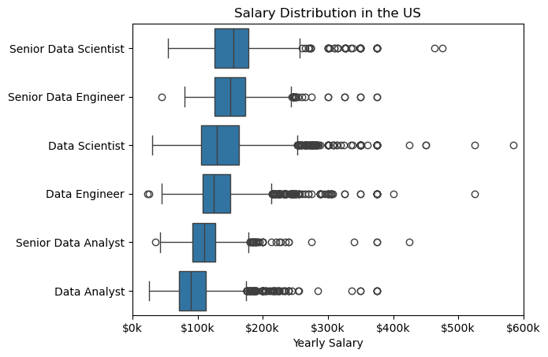
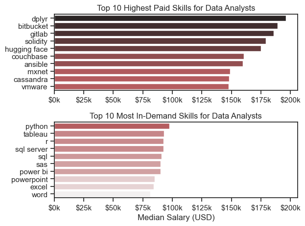

# The Analysis
## 1. What are the most demanded skills for the top 3 most popular data roles?

To find the most demanded skills for the top 3 most popular data roles. I filtered out those positions by which ones were the most popular, and got the top 5 skills for these top 3 roles. This query highlights the most popular job titles and their top skills, showing which skills I should pay attention to depending on the role I'm targeting.

View my notebook with detailed step here: [2_Skills_Demand.ipynb](My_Project_In_Data_Science/2_Skills_Demand.ipynb)

### Visualize Data 

```python
fig, ax=plt.subplots(len(job_titles) ,1)

for i,job_title in enumerate(job_titles):
    df_plot = df_skills_pers[df_skills_pers['job_title_short']==job_title].head(5)
    sns.barplot(data=df_plot,x='skill_percent',y='job_skills',ax=ax[i],hue='skill_count', palette='dark:b_r')

plt.show()
```

### Results
<div align="center">


</div>

### Insights

- Python is a versatile skill, highly demanded across all three roles, but most prominently for Data Scientists (72%) and Data Engineers (65%).

- SQL is the most requested skill for Data Analysts and Data Scientists, appearing in over half of the job postings for both roles. For Data Engineers, Python is the most sought-after skill, appearing in 68% of job postings.

- Data Engineers require more specialized technical skills (AWS, Azure, Spark) compared to Data Analysts and Data Scientists, who are expected to be proficient in more general data management and analysis tools (Excel, Tableau).

## 2. How are in-demand skills trending for Data Analysts?


### Visualize Data 
```python
from matplotlib.ticker import PercentFormatter

df_plot = df_DA_US_percent.iloc[:,:5]
sns.lineplot(data=df_DA_US_percent,dashes=False,legend=False)

ax = plt.gca()
ax.yaxis.set_major_formatter(PercentFormatter(decimals=0))

plt.show ()
```

### Results
<div align="center">



*Bar graph visualizing the trending top skills for data analysts in the US in 2023.*
</div>

### Insights

- Python is a versatile skill, highly demanded across all three roles, but most prominently for Data Scientists (72%) and Data Engineers (65%).

- SQL is the most requested skill for Data Analysts and Data Scientists, appearing in over half of the job postings for both roles. For Data Engineers, Python is the most sought-after skill, appearing in 68% of job postings.

- Data Engineers require more specialized technical skills (AWS, Azure, Spark) compared to Data Analysts and Data Scientists, who are expected to be proficient in more general data management and analysis tools (Excel, Tableau).


## 3. How well do jobs and skills pay for Data
### Salary Analysis  for Data Nerds 
### Visualize Data 

```python
sns.boxplot(df_US_top6,x='salary_year_avg',y='job_title_short',order=job_ordred)
ax=plt.gca()
ax.xaxis.set_major_formatter(lambda x,_:f'${int(x/1000)}k')

plt.sow()
```
### Results
<div align="center">



*Box plot visualizing the salary destributions for the top 6 job titles.*
</div>
 
### Insights
- There's significant variation in salary ranges across different job titles, Senior Data Scientist positions tend to have the highest salary potential, with up to $600,000, indicating the high value placed on advanced data skills and experience in the industry.

- Senior Data Engineer and Senior Data Scientist roles show a considerable number of outliers at the higher end of the salary spectrum, suggesting that exceptional skills or circumstances can lead to high pay in these roles. In contrast, Data Analyst roles demonstrate more consistency in salary, with fewer outliers.

- The median salaries increase with the seniority and specialization of the roles. Senior roles (Senior Data Scientist, Senior Data Engineer) not only have higher median salaries but also larger differences in typical salaries, reflecting greater variance in compensation as responsibilities increase.

### Highest Paid & Most Demanded Skills for Data 
### Visualize Data

```python
fig, ax=plt.subplots(2,1)

# Top 10 Highest Paid Skills for Data Analysts
sns.barplot(data=df_hight10_paid,x='median',y=df_hight10_paid.index,ax=ax[0],legend=False, hue='median',palette='dark:r_r') 

# Top 10 Most In-Demand Skills for Data Analysts
sns.barplot(data=df_top10_skills,x='median',y=df_top10_skills.index,ax=ax[1],legend=False, hue='median',palette='light:r')


plt.sow()
```
### Results
<div align="center">


*Two separate bar graphs visualizing the highest paid skills and most in-demand skills for data analysts in the US.*
</div>

### Insights
- The top graph shows specialized technical skills like dplyr, Bitbucket, and GitLab are associated with higher salaries, some reaching up to $200,000, suggesting that advanced technical proficiency can increase earning potential.

- The bottom graph highlights that foundational skills like Excel, PowerPoint, and SQL are the most in-demand, even though they may not offer the highest salaries. This demonstrates the importance of these core skills for employability in data analysis roles.

- There's a clear distinction between the skills that are highest paid and those that are most in-demand. Data analysts aiming to maximize their career potential should consider developing a diverse skill set that includes both high-paying specialized skills and widely demanded foundational skills